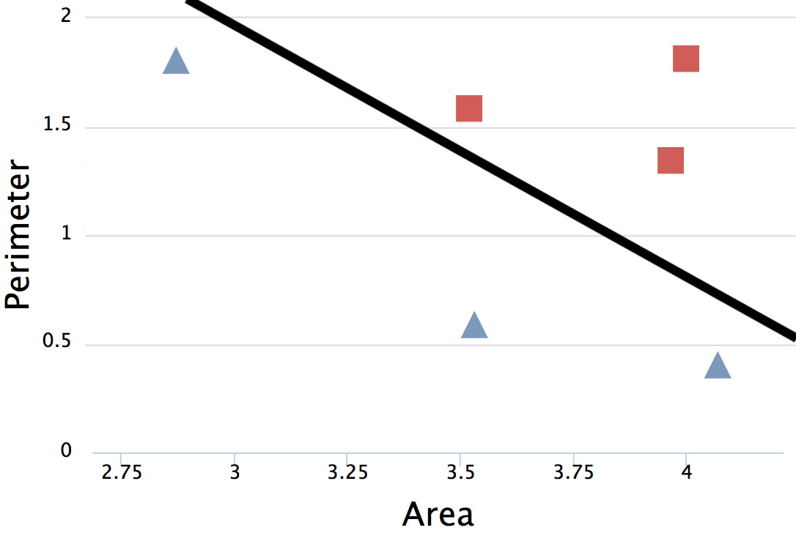

<!-- .slide: data-background="images/network-background.jpg" class="background" -->

<h2>The Institute for Ethical AI & ML</h2>
<h4>A practical framework for Ethical ML</h4>

   
   
    Alejandro Saucedo   
    <a href="http://twitter.com/AxSaucedo">@AxSaucedo</a> 
    <a href="http://linkedin.com/in/AxSaucedo">in/axsaucedo</a> 
   

[NEXT]
<!-- .slide: data-background="images/network-background.jpg" class="background" -->

<h2>The Institute for Ethical AI & ML</h2>
<h4>A practical framework for Ethical ML</h4>

<table class="bio-table">
  <tr>
    <td style="float: left">
        
         
        Alejandro Saucedo
         
         
    </td>
    <td style="float: left; color: white; font-size: 0.7em;">

         
        Chairman
         
        <a style="color: cyan" href="http://ethical.institute">The Institute for Ethical AI & ML</a>
         
         
        AI Fellow / Member
         
        <a style="color: cyan" href="#">The RSA & EU AI Alliance</a>
         
         
        Advisor
         
        <a style="color: cyan" href="http://teensinai.com">TeensInAI.com initiative</a>
         
         
        Head of Solutions Engineering
         
        <a style="color: cyan" href="http://eigentech.com">Eigen Technologies</a>
         
         
        
    </td>
  </tr>
  <tr>
  </tr>
</table>

[NEXT]
<!-- .slide: data-background="images/network-background.jpg" class="background smallquote" -->

#### The Institute for Ethical AI & ML
<iframe style="height: 50vh; width: 100vw" src="http://ethical.institute"></iframe>
#### <a href="http://ethical.institute">http://ethical.institute</a>

[NEXT]
<!-- .slide: data-background="images/network-background.jpg" class="background smallquote" -->

## A practical framework for Ethical ML

> AI/ML Recap
>  
>  
> Opportunities & Risks
>
> Ethics by design
> 
> Next steps!

[NEXT]
<!-- .slide: data-background="images/particles.gif" class="background smallquote" -->

# #LetsDoThis

[NEXT SECTION]
<!-- .slide: data-background="images/parti.png" class="background smallquote" style="color: white" -->

# 1. Recap on AI & Machine Learning

[NEXT]
<!-- .slide: data-background="images/parti.png" class="background smallquote" style="color: white" -->

## There 2 main approaches to AI

* Hard coding the rules (such as what you'd do in complex excel formulas)

## or

* Building systems that can "learn the rules" by learning from examples

[NEXT]
<!-- .slide: data-background="images/parti.png" class="background smallquote" style="color: white" -->

## The "AI" most people refer to

The main sub-field that currently people refer to when they
talk about AI is the latter - **Machine Learning**

[NEXT]
<!-- .slide: data-background="images/parti.png" class="background smallquote" style="color: white" -->

## In essence, all Machine Learning is:

If give you an example, would you be able to learn the answers?

[NEXT]
<!-- .slide: data-background="images/parti.png" class="background smallquote" style="color: white" -->
Given some input data, predict the correct output

Let's try to build a system to predict whether a shape is a square or a triangle

## How do we do this?

[NEXT]
<!-- .slide: data-background="images/parti.png" class="background smallquote" style="color: white" -->
## First, let's visualise it

* Imagine a 2-d plot
* The x-axis is the area of the input shape
* The y-axis is the perimeter of the input shape

[NEXT]
<!-- .slide: data-transition="slide-in fade-out" data-background="images/parti.png" class="background smallquote" style="color: white" -->
## We want to find a division line

 

The line defined by function
 
 
**$f(x̄) = mx̄ + b$**, where:
 
 
**x̄** is input (area & perimeter) </li>
 
 
**m** and **b** are weights/bias
 

[NEXT]
<!-- .slide: data-transition="fade-in slide-out" data-background="images/parti.png" class="background smallquote" style="color: white" -->
## So we can predict new data

 

The result **$f(x̄)$** states whether it's a triangle or square
 
 
(e.g. if it's larger than 0.5 it's triangle otherwise square)

 
 

[NEXT]
<!-- .slide: data-background="images/parti.png" class="background smallquote" style="color: white" -->

So now let's start with a blank brain

[  ]

The machine knows nothing yet...

[NEXT]
<!-- .slide: data-background="images/parti.png" class="background smallquote" style="color: white" -->
Now let's take some data examples

And let the machine do the learning

[NEXT]
<!-- .slide: data-transition="slide-in fade-out" data-background="images/parti.png" class="background smallquote" style="color: white" -->
## The machine does the learning

We give it two examples (one square, one triangle)

[NEXT]
<!-- .slide: data-transition="fade-in" data-background="images/parti.png" class="background smallquote" style="color: white" -->
## The machine does the learning

We give it more examples

[NEXT]
<!-- .slide:data-transition="fade-in slide-out" data-background="images/parti.png" class="background smallquote" style="color: white" -->
## The machine does the learning

and more...

[NEXT]
<!-- .slide: data-background="images/parti.png" class="background smallquote" style="color: white" -->
## Minimising loss function

We optimise the model by **minimising its loss**.

Keep adjusting the weights...

...until loss is not getting any smaller.

[NEXT]
<!-- .slide: data-transition="slide-in fade-out" data-background="images/parti.png" class="background smallquote" style="color: white" -->
## Finding the weights!

When it finishes, we find optimised weights and biases

i.e. **$f(x̄)$ = triangle  if ($0.3 x̄ + 10$) > 0.5 else square**

[NEXT]
<!-- .slide: data-transition="fade-in slide-out" data-background="images/parti.png" class="background smallquote" style="color: white" -->
## Now predict new data

We now have a system that "knows" how to differentiate triangles from squares

[NEXT]
<!-- .slide: data-background="images/parti.png" class="background smallquote" style="color: white" -->

### Perceptron algorithm!

Remember our function `f(x) = mx + b`

This is the same function for a neuron (perceptron)

[NEXT]
<!-- .slide: data-background="images/parti.png" class="background smallquote" style="color: white" -->
### Instead of just one neuron

[NEXT]
<!-- .slide: data-background="images/parti.png" class="background smallquote" style="color: white" -->
### We just have many

This gives the function more flexibility

[NEXT]
<!-- .slide: data-background="images/parti.png" class="background smallquote" style="color: white" -->
### With a few layers

This gives more flexibility for learning

[NEXT]
<!-- .slide: data-background="images/parti.png" class="background smallquote" style="color: white" -->
### Deep Networks &mdash; many hidden layers

## Allows for very complex cases

[NEXT SECTION]
<!-- .slide: data-background="images/partistat.png" class="background smallquote" style="color: white" -->

# 2. Opportunities and risks of AI/ML

[NEXT]
<!-- .slide: data-background="images/partistat.png" class="background smallquote" style="color: white" -->

## AI has a lot of potential

* Real time optimisation / Predictive analytics
* Strategic optimisation / Forecasting
* Radical personalisation
* Data analysis from (real) big data
* Automation of operational processes
* Anomality detection
* Information retrieval
* Unstructured data processing

[NEXT]
<!-- .slide: data-background="images/partistat.png" class="background smallquote" style="color: white" -->
## And is affecting many Sectors:

| | | | |
| - | - | - | - |
| Automotive | Manufacturing | Consumer | Defense |
| Agriculture | Energy | Healthcare | Pharma | 
| Public | Media | Telecom | Transport |
| Education | Legal | Programming | Construction | 
| Space | Finance | Security | | 
| | | | |

[NEXT]
<!-- .slide: data-background="images/partistat.png" class="background smallquote" style="color: white" -->

# Some technologies can get out of hand
## Let's have a look

[NEXT]
<!-- .slide: data-background="images/partistat.png" class="background smallquote" style="color: white" -->

## Synthetic Face Generation
<!--<iframe  data-src="https://www.youtube.com/embed/AmUC4m6w1wo?rel=0&amp;controls=0&amp;showinfo=0&amp;start=18&amp;autoplay=1" frameborder="0" allow="autoplay; encrypted-media" allowfullscreen></iframe>-->
<video width="560" height="315" controls >
  <source src="videos/fakeobama.mp4#t=18" type="video/mp4">
</video>

[NEXT]
<!-- .slide: data-background="images/partistat.png" class="background smallquote" style="color: white" -->

## Synthetic Voice Generation
<!--<iframe width="100%" height="300" scrolling="no" frameborder="no" allow="autoplay" data-src="https://w.soundcloud.com/player/?url=https%3A//api.soundcloud.com/tracks/318661840&color=%23ff5500&auto_play=true&hide_related=false&show_comments=true&show_user=true&show_reposts=false&show_teaser=true&visual=true"></iframe>-->
<video width="560" height="315" controls >
  <source src="videos/lyrebird.mp3" type="audio/mpeg">
</video>

[NEXT]
<!-- .slide: data-background="images/partistat.png" class="background smallquote" style="color: white" -->
## Using bots on top of voice
<!--<iframe width="560" height="315" data-src="https://www.youtube.com/embed/bd1mEm2Fy08?rel=0&amp;controls=0&amp;showinfo=0&amp;start=60&amp;autoplay=1" frameborder="0" allow="autoplay; encrypted-media" allowfullscreen></iframe>-->
<video width="560" height="315" controls >
  <source src="videos/google-duplex.mp4#t=60" type="video/mp4">
</video>

[NEXT]
<!-- .slide: data-background="images/partistat.png" class="background smallquote" style="color: white" -->
## And there's already a global bot industry
<iframe src="https://www.technologyreview.com/s/611123/inside-the-business-model-for-botnets/" style="width: 100%; height: 50vh"></iframe>

[NEXT]
<!-- .slide: data-background="images/partistat.png" class="background smallquote" style="color: white" -->

## Tricking Machine Learning Classifiers
<!--<iframe width="560" height="315" data-src="https://www.youtube.com/embed/i1sp4X57TL4?rel=0&amp;controls=0&amp;showinfo=0&amp;autoplay=1" frameborder="0" allow="autoplay; encrypted-media" allowfullscreen></iframe>-->
<video width="560" height="315" controls >
  <source src="videos/trick-class.mp4" type="video/mp4">
</video>

[NEXT]
<!-- .slide: data-background="images/partistat.png" class="background smallquote" style="color: white" -->
# We could say
## AI has a Hallucination problem that’s hard to Fix...

[NEXT]
<!-- .slide: data-background="images/partistat.png" class="background smallquote" style="color: white" -->
## It becomes a problem with cars...
<!--<iframe width="560" height="315" data-src="https://www.youtube.com/embed/c_5EH3CBtD0?rel=0&amp;controls=1&amp;showinfo=0&amp;start=60&amp;mute=1&amp;autoplay=1" frameborder="0" allow="autoplay; encrypted-media" allowfullscreen></iframe>-->
<video width="560" height="315" controls muted>
  <source src="videos/car.mp4#t=60" type="video/mp4">
</video>

[NEXT]
<!-- .slide: data-background="images/partistat.png" class="background smallquote" style="color: white" -->
## Did anyone say robots?
<!--<iframe width="560" height="315" data-src="https://www.youtube.com/embed/knoOXBLFQ-s?rel=0&amp;controls=1&amp;showinfo=0&amp;autoplay=1" frameborder="0" allow="autoplay; encrypted-media" allowfullscreen></iframe>-->
<video width="560" height="315" controls muted data-autoplay>
  <source src="videos/boston.mp4" type="video/mp4">
</video>

## Or maybe drones...

[NEXT]
<!-- .slide: data-background="images/partistat.png" class="background smallquote" style="color: white" -->
## Data is more personalised
<!--<iframe width="560" height="315" data-src="https://www.youtube.com/embed/pon3zOxMH8M?rel=0&amp;controls=1&amp;showinfo=0&amp;autoplay=1&amp;start=18&amp;mute=1" frameborder="0" allow="autoplay; encrypted-media" allowfullscreen></iframe>-->
<video width="560" height="315" controls muted data-autoplay>
  <source src="videos/23andme.mp4#t=17" type="video/mp4">
</video>

[NEXT]
<!-- .slide: data-background="images/partistat.png" class="background smallquote" style="color: white" -->
## Regulation is playing catchup
<iframe src="https://www.crowdemotion.co.uk/" style="width: 100%; height: 50vh"></iframe>
## (e.g. GDPR)

[NEXT]
<!-- .slide: data-background="images/partistat.png" class="background smallquote" style="color: white" -->

## What are the implications?
* Large scale automation of processes and people
* New generation cybersecurity (talk 21st)
* Improvement in defense (and attack) systems
* Danger of algorithmic bias (beyond human traits)
* Disasters due to lack of regulation
* Dangers of "staying behind" in the AI race
* Increased efficiency, reduction of cost

[NEXT]
<!-- .slide: data-background="images/partistat.png" class="background smallquote" style="color: white" -->
## Certainly some risk
# But a lot of opportunity

[NEXT]
<!-- .slide: data-background="images/partistat.png" class="background smallquote" style="color: white" -->
## How can we ensure the safe and responsible development of AI?

[NEXT SECTION]
<!-- .slide: data-background="images/space.jpg" class="background smallquote" style="color: white" -->

# 3. AI Ethics by design

[NEXT]
<!-- .slide: data-background="images/space.jpg" class="background smallquote" style="color: white" -->

## What even are ethics and why are they important?

[NEXT]
<!-- .slide: data-background="images/space.jpg" class="background smallquote" style="color: white" -->

# Ethics are
The moral principles that govern a person's behaviour or the conducting of an activity.

* how to live a good life
* our rights and responsibilities
* the language of right and wrong
* moral decisions - what is good and bad?

[NEXT]
<!-- .slide: data-background="images/space.jpg" class="background smallquote" style="color: white" -->

## We apply them unconsciously

* Is cheating on a test "bad"?
* When should you stick up for others? 
* Is there a situation where lying isn't bad?
* Should you tell on someone to help them?

[NEXT]
<!-- .slide: data-background="images/space.jpg" class="background smallquote" style="color: white" -->

## The wild wild west of AI Ethics

# new field, new surprises

[NEXT]
<!-- .slide: data-background="images/space.jpg" class="background smallquote" style="color: white" -->

## People can be:

| | | |
| - | - | - |
| | Conscious | Unconscious | 
| Ethical | ✅ | ❌ |
| Unethical | ❌ | ❌ |
| | | |

 

### We want to be conscious and ethical

[NEXT]
<!-- .slide: data-background="images/space.jpg" class="background smallquote" style="color: white" -->

## The challenge: Dilemmas of autonomous systems
<video width="560" height="315" controls muted data-autoplay> 
  <source src="videos/dilemma.mp4#t=13" type="video/mp4">
</video>

[NEXT]
<!-- .slide: data-background="images/space.jpg" class="background smallquote" style="color: white" -->

Instead of going into a philosophical discussion...

## Let's address this in 

## the fundamental tech design

[NEXT]
<!-- .slide: data-background="images/space.jpg" class="background smallquote" style="color: white" -->

Ensure our development is

# Human-centered

# Industry-ready

# Transparent

[NEXT]
<!-- .slide: data-background="images/space.jpg" class="background smallquote" style="color: white" -->

## How can we address this?
<!--<iframe width="560" height="315" data-src="https://www.youtube.com/embed/HluANRwPyNo?rel=0&amp;controls=0&amp;showinfo=0&amp;start=0&amp;autoplay=1&amp;mute=1" frameborder="0" allow="autoplay; encrypted-media" allowfullscreen></iframe>-->
<video width="560" height="315" controls muted data-autoplay>
  <source src="videos/programming.mp4" type="video/mp4">
</video>

### Disclaimer: It's not that exciting

[NEXT]
<!-- .slide: data-background="images/space.jpg" class="background smallquote" style="color: white" -->

## IEML phased rollout plan
* **Phase 1 - Ethical ML by pledge**
    * Commit as a technology leader  
* **Phase 2 - Ethical ML by process**
    * Implement the internal processes to your workplace  
* **Phase 3 - Ethical ML by certification**
    * Obtain the certifications required  
* **Phase 4 - Ethical ML by regulation**
    * Implement policy based on case-studies

[NEXT]
<!-- .slide: data-background="images/space.jpg" class="background smallquote" style="color: white" -->

## Starting with 
# Phase 1

[NEXT]
<!-- .slide: data-background="images/space.jpg" class="background smallquote" style="color: white" -->

## The 8 commitments of Phase 1

<iframe style="height: 50vh; width: 100vw" src="http://ethical.institute"></iframe>

#### You can sign the pledge at <a href="http://ethical.institute">ethical.institute</a>

[NEXT]
<!-- .slide: data-background="images/space.jpg" class="background smallquote" style="color: white" -->

## Case study: Automated Insurance Calculator

A machine learning system that predicts life insurance using historical datasets

[NEXT]
<!-- .slide: data-background="images/space.jpg" class="background smallquote" style="color: white" -->

## 1. Ensure augmented (as opposed to artificial)

<h3>Bad</h3>
Using predictions without checks

 
 

<h3>Better</h3>
Ensure human sign-off process

_note_
### Bad
Have the system automatically going through all records taking the first-hand predictions without signoff on lower confidence fields

### Better
Ensure there is a process for a human signoff based on predictions and have a process for low confidence fields

[NEXT]
<!-- .slide: data-background="images/space.jpg" class="background smallquote" style="color: white" -->

## 2. Awareness of bias in data and models

<h3>Bad</h3>
Train on ALL data

 
 

<h3>Better</h3>
Understand bias to avoid discrimination

_note_

### Bad
Train the dataset on all previous cases and assume it works well

### Better
Run in-depth analysis of distribution of data based on traits to ensure the model does not discriminate unfairly

[NEXT]
<!-- .slide: data-background="images/space.jpg" class="background smallquote" style="color: white" -->

## 3. Address job displacement implications

<h3>Bad</h3>
Push for automation unconsciously

 
 

<h3>Better</h3>
Understand and address automation implications

_note_

### Bad
Push for automation without taking into consideration the implications of job automation

### Better
Understand the implication of both automating the process and reducing the costs for the service (which may lead to total increase in demand)

[NEXT]
<!-- .slide: data-background="images/space.jpg" class="background smallquote" style="color: white" -->

## 4. Practical understanding on accuracy

<h3>Bad</h3>
Take naive accuracy number and aim to increase

 
 

<h3>Better</h3>
Have an objective, consistent and transparency metric for accuracy

_note_
### Bad
Take percentage accuracy increases as face-value and assume a higher number is better

### Better
Ensure you run consistent cross-validated and bias-reduced sets of tests/simulations to ensure that accuracy increase is objective

[NEXT]
<!-- .slide: data-background="images/space.jpg" class="background smallquote" style="color: white" -->

## 5. Awareness and plan for audit trail

<h3>Bad</h3>
Override models and save hardcoded answers

 
 

<h3>Better</h3>
Store labelled data and changelog of work

_note_

### Bad
Don't store the models together with its respective metadata which doesn't allow for transparency and audit trail

### Better
Ensure that models are stored with traceable labels used, as well as an abstracted set of the features 

[NEXT]
<!-- .slide: data-background="images/space.jpg" class="background smallquote" style="color: white" -->

## 6. Backwards compatibility and versioning

<h3>Bad</h3>
Assume previous models won't be re-used 

 
 

<h3>Better</h3>
Have a process to ensure backwards compatibility of features

_note_
none

[NEXT]
<!-- .slide: data-background="images/space.jpg" class="background smallquote" style="color: white" -->

## 7. Transparency on data/meta-data collection and usage

<h3>Bad</h3>
Assume stakeholders understand data usage

 
 

<h3>Better</h3>
Provide comprehensible and transparent overview of storage, ownership and usage of the data/meta-data

_note_
none

[NEXT]
<!-- .slide: data-background="images/space.jpg" class="background smallquote" style="color: white" -->

## 8. Identify and address cybersecurity risks

<h3>Bad</h3>
Assume there isn't a need to protect models 

 
 

<h3>Better</h3>
Identify and address threats for tricking, circumventing or hacking mathematical models created

_note_
none

[NEXT]
<!-- .slide: data-background="images/space.jpg" class="background smallquote" style="color: white" -->

## You have completed Phase 1!

<iframe style="height: 50vh; width: 100vw" src="http://ethical.institute"></iframe>
#### You can sign the pledge at <a href="http://ethical.institute">ethical.institute</a>

[NEXT]
<!-- .slide: data-background="images/space.jpg" class="background smallquote" style="color: white" -->

# Next steps

Applying this thinking into your actual projects 

## #LetsDoThis

[NEXT SECTION]
<!-- .slide: data-background="images/spaceline.jpg" class="background smallest" style="color: white" -->
# 4. Workshop & Wrapping up

[NEXT]
<!-- .slide: data-background="images/spaceline.jpg" class="background smallest" style="color: white" -->
# Groups 1..n
* Get together with groups (next up)
* Pick usecase
* Pick 2-3 pledges
* Brainstorm "bad" and "better"
* Share thoughts

[NEXT]
<!-- .slide: data-background="images/spaceline.jpg" class="background smallest" style="color: white" -->

<h2>Usecases</h2>

Self-driving cars
 
Emotion detection ads
 
Automatic court prediction
 
Smart classrooms
 
Cameras crime detection
 
Smart robot waiters

<h2>Pledges</h2>

1. Augmented vs Artificial
 
2. Bias & discrimination
 
3. Job automation
 
4. Accuracy understanding
 
5. Audit trail
 
6. Backwards compatibility
 
7. Data transparency
 
8. Cybersecurity

[NEXT]
<!-- .slide: data-background="images/network-background.jpg" class="background smallquote" -->

## Today we covered

> AI/ML Recap
>  
>  
> Opportunities & Risks
>
> Ethics by design
> 
> Next steps!

[NEXT]
<!-- .slide: data-background="images/network-background.jpg" class="background" -->
### Code
https://github.com/axsauze/ml-ethics

### Slides
https://axsauze.github.io/ml-ethics

[NEXT]
<!-- .slide: data-background="images/network-background.jpg" class="background" -->

<h2>The Institute for Ethical AI & ML</h2>

<h4>Cybersecurity in an AI enabled world</h4>

<table class="bio-table">
  <tr>
    <td style="float: left">
        
         
        Alejandro Saucedo
         
    </td>
    <td style="float: left; color: white; font-size: 0.7em;">

         
        Chairman
         
        <a style="color: cyan" href="http://ethical.institute">The Institute for Ethical AI & ML</a>
         
         
        AI Fellow / Member
         
        <a style="color: cyan" href="#">The RSA & EU AI Alliance</a>
         
         
        Advisor
         
        <a style="color: cyan" href="http://teensinai.com">TeensInAI.com initiative</a>
         
         
        Head of Solutions Engineering
         
        <a style="color: cyan" href="http://eigentech.com">Eigen Technologies</a>
         
         
        
    </td>
  </tr>
  <tr>
  </tr>
</table>

